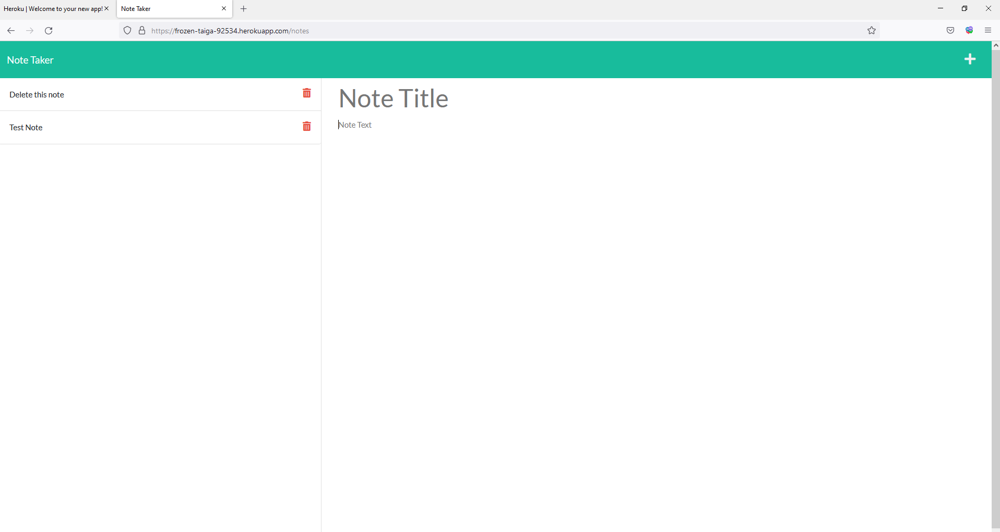

# Note-Taker
  ## Badges
  
  
  ## Table of Contents
  * [License](#license)
  * [Built With](#built-with) 
  * [Description](#description)
  * [Installation](#installation)
  * [Usage](#usage)
  * [How to Contribute](#how-to-contribute)
  * [Tests](#tests)
  * [Questions?](#questions)
  
  ## License
  Read more about MIT here:
  [MIT](https://opensource.org/licenses/MIT)

  ## Built With
  * HTML
  * CSS
  * Boostrap
  * JavaScript
  * Node.js
    * Express.js
  
  ## Description
  This application was created to allow a user to write and save notes. The app uses express.js back-end; saving & retrieving note data from a JSON file. The finished application is deployed to Heroku. 

  
  
  ## Installation
  Clone the project. Run "npm i" in your terminal to install necessary packages.
  
  ## Usage
  After package installation, run "node server.js" in your terminal. This will run the server locally where you can open a browser and navigate to localhost:3001. To stop the server press control + c inyour terminal window. 
  
  ## How to Contribute
  [Contributor Covenant](https://www.contributor-covenant.org/)  
  Not Applicable
  
  ## Tests
  Not Applicable
  
  ## Questions?
  ### Reach me here: 
  [erbeard](https://github.com/erbeard)  
  sample@sample.com
